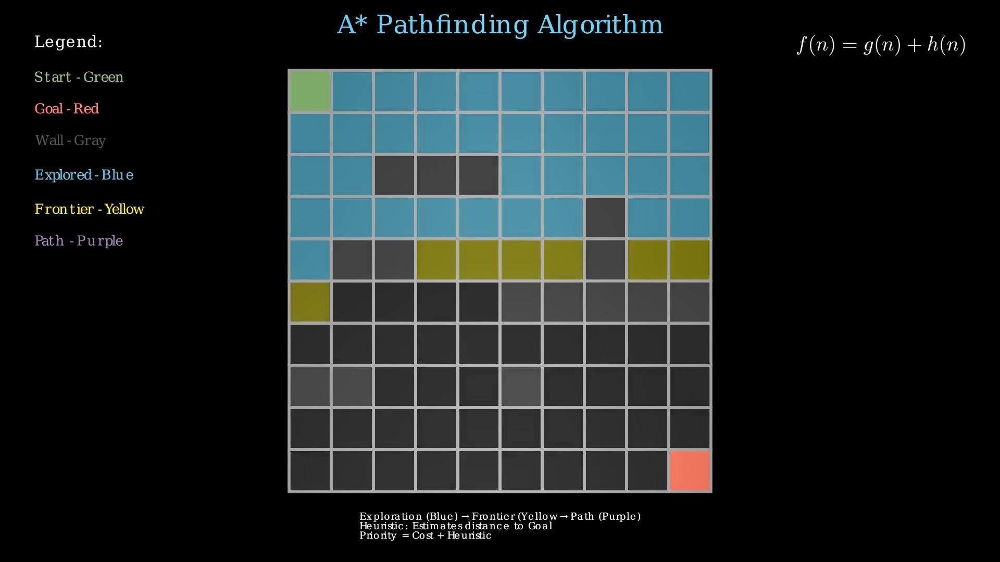

# A* Pathfinding Visualization

This project is a visual demonstration of the A* pathfinding algorithm using [Manim](https://www.manim.community/). It generates an animation that shows how the algorithm explores a grid, evaluates paths, and finds the shortest route from a start to a goal position while avoiding obstacles.



## 📽️ Demo

[Watch the algorithm in action as it:](https://youtu.be/wtcoBboitdA)
- Explores neighboring cells in blue
- Prioritizes cells using a cost + heuristic strategy
- Highlights the final optimal path in purple

## 🚀 Features

- Animated grid construction
- Start (green) and goal (red) markers
- Hardcoded wall obstacles (gray)
- Frontier nodes highlighted in yellow
- Explored area shown in blue
- Final path shown in purple
- Math formula: `f(n) = g(n) + h(n)` displayed
- Legend and explanation included in video

## 🧠 Algorithm Overview

This project implements the A* algorithm with the Manhattan distance as the heuristic:

f(n) = g(n) + h(n)


- `g(n)`: Actual cost from the start node to current node
- `h(n)`: Estimated cost from current node to the goal (heuristic)

The algorithm uses a priority queue (`heapq`) to maintain the frontier, always selecting the cell with the lowest `f(n)`.

## 🧱 Grid Setup

- 10x10 square grid
- Cell size: 0.6 units
- Start point: top-left `(0, 0)`
- Goal point: bottom-right `(9, 9)`
- Obstacles: hardcoded coordinates (e.g., `(2, 2)`, `(5, 7)`, etc.)

## 🎨 Color Legend

| Element    | Color      |
|------------|------------|
| Start      | Green      |
| Goal       | Red        |
| Wall       | Dark Gray  |
| Explored   | Blue       |
| Frontier   | Yellow     |
| Final Path | Purple     |

## 📦 Requirements

- Python 3.8+
- [Manim Community Edition](https://docs.manim.community/en/stable/installation.html)
- NumPy

To install dependencies:

```bash
pip install manim numpy
```

▶️ How to Run

Render the animation using Manim:

```bash
manim -pql A_pathfinding_algo.py PathfindingVisualization
```

Flags:

    -p: Preview after rendering

    -q l: Low quality (faster rendering); replace with -q h for high quality

🧩 File Structure

    A_pathfinding_algo.py: Main animation script

    Contains PathfindingVisualization(Scene) which builds and animates the grid and algorithm

💡 Inspirations

    A* pathfinding visualizations from various game dev and AI tutorials

    Designed to be accessible, clear, and educational

🛠️ Customization

    Modify the obstacles list in add_obstacles() to change the maze

    Adjust grid size by changing self.grid_size

    Switch heuristic by modifying the heuristic() function

🤝 Support This Work

*Maintained with ❤️ by **Omniacs.DAO** – accelerating digital public goods through data.*
---
🛠️ Keep public infrastructure thriving. Buy [$IACS](http://dexscreener.com/base/0xd4d742cc8f54083f914a37e6b0c7b68c6005a024) on Base — CA: 0x46e69Fa9059C3D5F8933CA5E993158568DC80EBf
