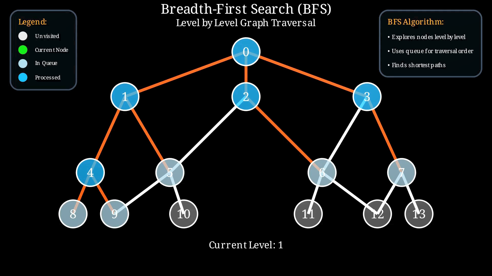

# Breadth-First Search (BFS) Visualization

This project visually demonstrates the **Breadth-First Search (BFS)** algorithm using [Manim](https://www.manim.community/). It generates an animation that shows how BFS explores a graph level by level, using a queue to ensure breadth-wise traversal.



## 🎥 Demo

[Watch a demo here!](https://youtu.be/GAKOuP4q3VU)

The animation:
- Displays a multi-level graph
- Visually explores nodes from top to bottom, layer by layer
- Uses color coding to represent node states (e.g., in queue, processed)
- Animates traversal paths with edge highlighting
- Includes an explanation box and a legend

## 🔍 Algorithm Summary

**Breadth-First Search (BFS)** is an uninformed graph traversal algorithm that explores neighbors before diving deeper.

Key properties:
- Visits nodes in level order
- Guarantees shortest path in unweighted graphs
- Uses a FIFO queue to track exploration

## 🎨 Visualization Details

### Node States

| State           | Color       |
|-----------------|-------------|
| Unvisited       | Light Gray  (`#E6E6E6`) |
| Current Node    | Bright Green (`#00FF00`) |
| In Queue        | Light Blue  (`#ADD8E6`) |
| Processed       | Deep Sky Blue (`#00BFFF`) |
| Traversed Edge  | Orange Red (`#FF4500`) |

### Layout

- Graph includes 14 nodes arranged in a tree-like structure
- Nodes are labeled `0` through `13`
- Edges connect nodes to form levels from `0` to `3`

### On-Screen Elements

- **Title**: “Breadth-First Search (BFS)”
- **Subtitle**: “Level by Level Graph Traversal”
- **Legend**: Color-coded explanation of node states
- **Explanation box**: BFS algorithm insights
- **Current Level indicator**: Updates as traversal proceeds

## 📦 Requirements

- Python 3.8+
- [Manim Community Edition](https://docs.manim.community/en/stable/)
- (Optional) `ffmpeg` for video rendering

Install required packages:

```bash
pip install manim
```

▶️ Running the Animation

To render the animation:

```bash
manim -pql BFS_Visualization.py BFSVisualization
```

Flags:

    -p: Preview video after rendering

    -q l: Low quality (use -qh or -qm for better rendering)

🧠 File Structure

    BFS_Visualization.py: Main script that creates and animates the BFS traversal

✏️ Customization Tips

    Modify the positions dictionary to rearrange nodes

    Change edge connections in the edges list

    Adjust node color or traversal behavior by modifying the construct() logic

📚 Educational Value

This visualization is ideal for:

    Teaching introductory graph traversal concepts

    Demonstrating BFS dynamics in classrooms or presentations

    Creating educational content on algorithms and data structures

---
🤝 Support This Work

*Maintained with ❤️ by **Omniacs.DAO** – accelerating digital public goods through data.*

🛠️ Keep public infrastructure thriving. Buy [$IACS](http://dexscreener.com/base/0xd4d742cc8f54083f914a37e6b0c7b68c6005a024) on Base — CA: 0x46e69Fa9059C3D5F8933CA5E993158568DC80EBf
