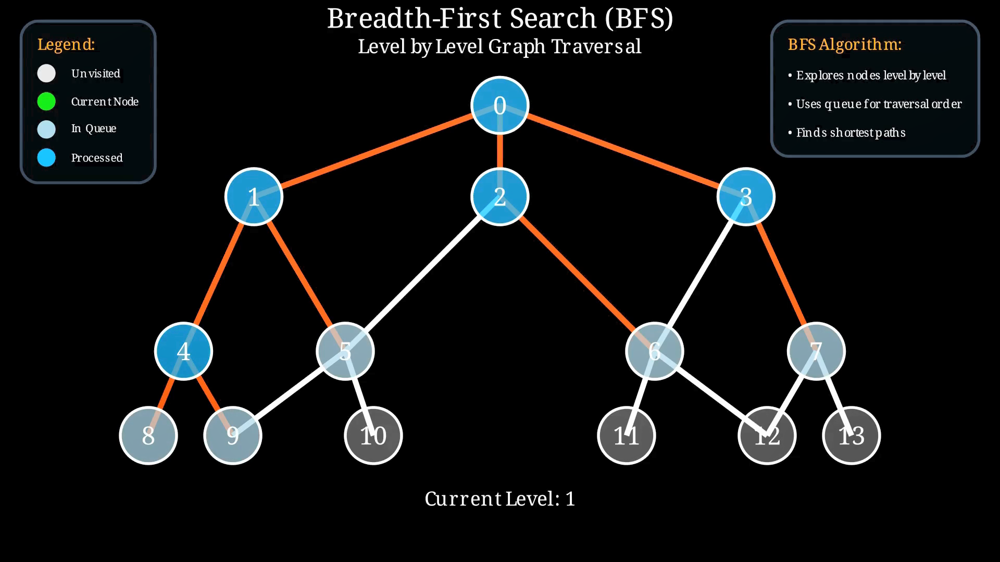

# Breadth-First Search (BFS) Visualization

Breadth-First Search is a graph traversal algorithm that explores nodes level by level. It is especially useful for finding the shortest path in unweighted graphs.

This folder contains a visualization showing how BFS visits each node in expanding layers, making it easier to understand how the algorithm avoids revisiting and ensures optimal path discovery.

Explore the visualization to see BFS in action and learn how it differs from other traversal methods!

