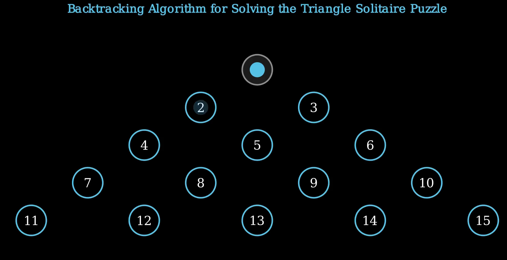

# Backtracking Algorithm for Triangle Solitaire Puzzle 🎯

This project visually demonstrates a **backtracking algorithm** for solving the classic **Triangle Peg Solitaire Puzzle** using [Manim](https://www.manim.community/). It includes move-by-move animations of correct decisions, mistakes, and backtracked reversals as the algorithm searches for a valid solution.



## 🧩 Puzzle Overview

The **Triangle Peg Solitaire Puzzle** starts with 14 pegs in a triangle formation and one empty spot. The goal is to reduce the board to a single peg by "jumping" over adjacent pegs (similar to checkers) and removing them.

## 📽️ What This Visualization Shows

[Watch it here!](https://youtu.be/AYKLSoF-6a0)

- The board setup in triangle form with 15 peg slots
- Animated peg moves: jump and removal of pegs
- Visualized **wrong turns** followed by **backtracking**
- Highlighted reversed moves during the backtrack phase
- Solution resumes after recovering from mistakes

## 🔁 Algorithm Highlights

This video demonstrates:
- **Recursive backtracking** through possible moves
- **Undoing invalid paths** by reversing the last few moves
- **Highlighting wrong moves in red** when backtracking
- A solution path that emerges only after several trial-and-error attempts

## 🎨 Visual Legend

| Element             | Appearance     |
|---------------------|----------------|
| Peg Present         | Blue circle    |
| Peg Number Label    | White number   |
| Removed Peg         | Disappears     |
| Empty Slot          | Light gray     |
| Reversed Moves      | Red highlight  |

## 📦 Requirements

- Python 3.8+
- [Manim Community Edition](https://docs.manim.community/en/stable/)

```bash
pip install manim
```

▶️ How to Run

Use the following command to render the animation:

```bash
manim -pql Backtracking_Algo.py PegGame
```

Flags:

    -p: Preview video after rendering

    -ql: Low quality (faster); use -qh or -qm for better quality

📁 File Structure

    Backtracking_Algo.py: Main Manim animation script

    README.md: Project documentation

🧠 Educational Value

This visualization is great for:

    Teaching backtracking algorithms

    Demonstrating decision-making in search problems

    Showing how errors are corrected algorithmically

    Understanding state management in recursive algorithms


---
🤝 Support Open Source

*Maintained with ❤️ by **Omniacs.DAO** – accelerating digital public goods through data.*

🛠️ Keep public infrastructure thriving. Buy [$IACS](http://dexscreener.com/base/0xd4d742cc8f54083f914a37e6b0c7b68c6005a024) on Base — CA: 0x46e69Fa9059C3D5F8933CA5E993158568DC80EBf
