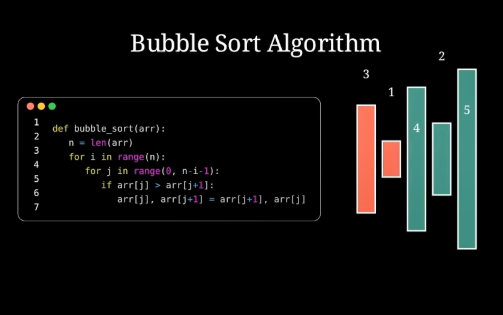

# Bubble Sort Animation

Bubble Sort is one of the simplest sorting algorithms, often used as an introduction to algorithmic thinking. It works by repeatedly stepping through the list, comparing adjacent elements, and swapping them if they are in the wrong order. Though not efficient for large datasets, it is ideal for teaching core sorting principles.

This folder provides an animated visualization of Bubble Sort in action, clearly showing how elements move step by step toward their sorted positions. It's a helpful resource for beginners to understand the concept of sorting and iteration.

Explore the animation and try modifying the data to see how the algorithm behaves!

