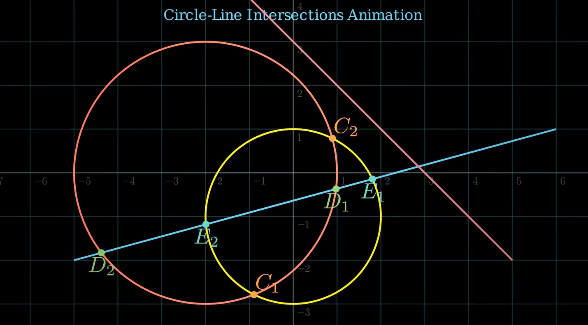

# 🎯 Circle and Line Intersection Visualization with Manim

This project demonstrates various **2D geometric intersections**—circle-line, circle-circle, and line-line—using animated constructions in [Manim](https://www.manim.community/). Each intersection is calculated mathematically and visualized dynamically with labeled points.



[Watch here!](https://youtu.be/xb_CYq7iO64)

## ✨ Features

- 🎥 Animated creation of:
  - Two circles
  - Two lines (secant and intersecting)
- 📍 Intersection Points:
  - Circle–Circle: Points `C₁`, `C₂`
  - Circle–Line: Points `D₁`, `D₂`, `E₁`, `E₂`
  - Line–Line: Point `F`
- 📐 Labeled coordinates and color-coded dots
- 💡 Mathematical formulas applied:
  - Euclidean geometry
  - Determinants
  - Analytic geometry

## 📊 Geometry Covered

| Type                | Description                        |
|---------------------|------------------------------------|
| Circle–Circle       | Two circles with radii 3 and 2     |
| Circle–Line         | A line intersecting both circles   |
| Line–Line           | Two lines intersecting in 2D plane |

The equations used are based on:

- [Wolfram: Circle-Line Intersection](https://mathworld.wolfram.com/Circle-LineIntersection.html)
- [John D. Cook: Circle-Circle Intersection](https://www.johndcook.com/blog/2023/08/27/intersect-circles/)

## 🧠 Educational Use

Ideal for:
- High school & college geometry instruction
- Interactive math learning
- Algorithmic visualization of analytic geometry

## 🧪 Intersection Functions

- `circle_line_intersection(circle, line)`  
- `circle_circle_intersection(circle1, circle2)`  
- `line_line_intersection(line1, line2)`  

Each function returns a list of NumPy 3D points that are then rendered with Manim.

## 🧰 Requirements

- Python 3.8+
- Manim Community Edition
- NumPy

Install via:

```bash
pip install manim numpy
```

▶️ How to Run

Render the animation using:

```bash
manim -pql circles_lines_intersection.py IntersectionTest

Use -qh instead of -pql for high-quality rendering.
```

📁 File Structure

    circles_lines_intersection.py — Main script containing math + animation

    README.md — Project documentation

---
*Maintained with ❤️ by **Omniacs.DAO** – accelerating digital public goods through data.*

🛠️ Keep public infrastructure thriving. Buy [$IACS](http://dexscreener.com/base/0xd4d742cc8f54083f914a37e6b0c7b68c6005a024) on Base — CA: 0x46e69Fa9059C3D5F8933CA5E993158568DC80EBf
