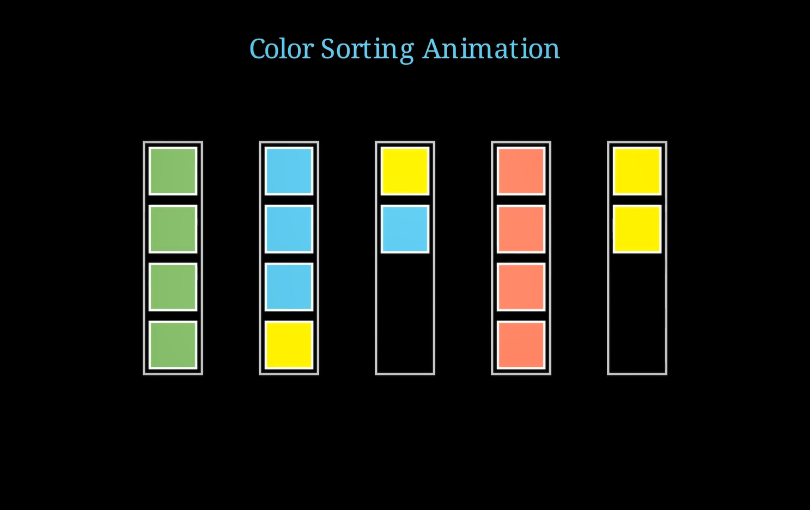

# 🧪 Color Sort Algorithm Visualization

This project visually demonstrates a **color sorting puzzle algorithm** using [Manim](https://www.manim.community/). It simulates pouring colored blocks between containers to sort them by color, using a predefined move sequence and smooth animations.



## 🎥 What You'll See

[Watch here!](https://youtu.be/pIO4U4LC7GA)

- Five vertical containers filled with mixed color blocks
- Blocks animated into stacks inside each container
- A sequence of 21 smart moves transferring blocks between containers
- A final screen that declares the puzzle solved

Ideal for fans of logic puzzles, animation, and algorithmic problem solving.

## 🧩 Puzzle Overview

- There are **5 containers**, each with capacity for 4 blocks.
- Four colors are used: **Red, Green, Blue, Yellow**
- The goal is to **sort each container by color**, such that each has uniform blocks
- Containers are manipulated using a series of `(from, to)` moves

## 🔁 How the Algorithm Works

This implementation doesn’t use search or optimization — instead, it **animates a known solution** by executing a fixed list of moves:

```python
moves = [
    (1, 5), (3, 5), (4, 1), (4, 5), (2, 4),
    (1, 3), (2, 1), (2, 4), (5, 2), (1, 5), (1, 2),
    (1, 5), (4, 2), (1, 4), (5, 1), (5, 1), (5, 1),
    (3, 1), (3, 5), (2, 5), (3, 2), (3, 5),
]
```

Each move:

    Pops the top block from the source container

    Pushes it onto the target container

    Animates the transition accordingly

🎨 Visual Elements

Item	Style
Containers	Vertical boxes (light gray)
Blocks	Colored squares (Red, Green, Blue, Yellow)
Final Message	Text overlay: “Solved with X Moves”

📦 Requirements

    Python 3.8+
    Manim Community Edition
    NumPy

```bash
pip install manim numpy
```

▶️ How to Run

To render the animation locally with Manim:

```bash
manim -pql Color_Sorting_Animation.py ColorSortingPuzzle
```
Flags:

    -p: Automatically preview after rendering
    -ql: Render in low quality (use -qh for high quality)

📁 File Structure

    Color_Sorting_Animation.py: Main animation script
    README.md: This documentation

🧠 Educational Use

Great for:

    Teaching state transitions in puzzles
    Demonstrating deterministic procedural logic
    Showing how precomputed move sequences can solve visual problems

---
*Maintained with ❤️ by **Omniacs.DAO** – accelerating digital public goods through data.*

🛠️ Keep public infrastructure thriving. Buy [$IACS](http://dexscreener.com/base/0xd4d742cc8f54083f914a37e6b0c7b68c6005a024) on Base — CA: 0x46e69Fa9059C3D5F8933CA5E993158568DC80EBf
