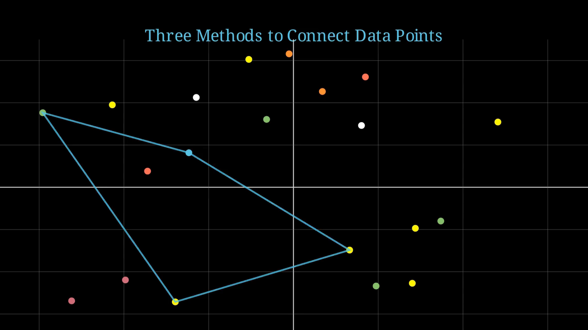

# 🔗 Connect the Dots: Three Methods of Visual Linking

This animation built with [Manim](https://www.manim.community/) demonstrates three distinct ways of visually connecting randomly placed dots on a coordinate plane. It’s a visual and artistic exploration of data linking methods: sequential, structured, and random.



[Watch here!](https://youtu.be/mwl42Cu3ZfM)

## 🎯 Key Features

- 🧭 A coordinate grid appears with animated axes
- 🎨 20 randomly positioned and color-coded dots
- ✏️ Three connection techniques:
  1. Connecting sequentially (dot-to-dot)
  2. Drawing geometric shapes
  3. Connecting points randomly

## 🧠 Educational Insights

This visualization:
- Illustrates pattern recognition
- Inspires data visualization ideas
- Demonstrates creative animation using Manim

## 🎨 Techniques Used

| Method                      | Description |
|-----------------------------|-------------|
| Sequence Linking            | Line drawn between each consecutive dot |
| Shape Formation             | Polygons drawn using selected point clusters |
| Random Connection           | Each dot connects to a random other dot |

## 📦 Requirements

- Python 3.8+
- Manim Community Edition
- NumPy

```bash
pip install manim numpy
```

▶️ How to Run

```bash
manim -pql ConnectTheDot.py connectTheDots
```

Use -qh for high-quality output.

📁 File Overview

    ConnectTheDot.py — Manim script

    README.md — Documentation

🧠 Use Cases

Perfect for:

    Visual arts projects

    Generative geometry experiments

    STEM visual learners

    Teaching data structure & graph theory foundations


---
🤝 Support Visual Learning

*Maintained with ❤️ by **Omniacs.DAO** – accelerating digital public goods through data.*

🛠️ Keep public infrastructure thriving. Buy [$IACS](http://dexscreener.com/base/0xd4d742cc8f54083f914a37e6b0c7b68c6005a024) on Base — CA: 0x46e69Fa9059C3D5F8933CA5E993158568DC80EBf
