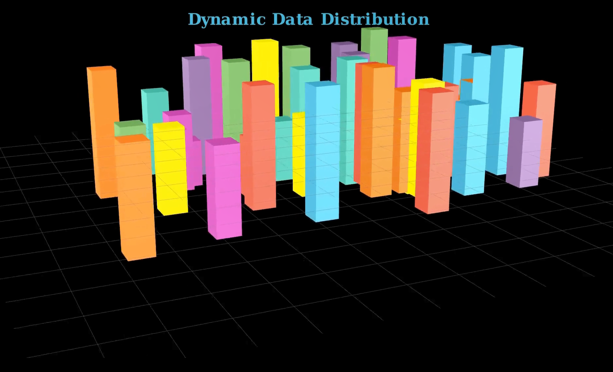

# 📊 Dynamic Data Distribution in 3D with Manim

This project visualizes **dynamic 3D data histograms** using [Manim](https://www.manim.community/). It creates an evolving "data cityscape" by animating dozens of colorful histogram bars growing from a base plane while the camera orbits for a full spatial effect.



[Watch here!](https://youtu.be/7agRXecBrk0)

## 🔍 What It Shows

- 50 colorful 3D bars (prisms) randomly positioned on a 2D grid
- Each bar grows vertically to represent simulated data "density"
- Smooth animated transitions for scale and movement
- Camera moves around the cityscape to showcase spatial perspective

## 🧠 Educational Applications

This animation is ideal for:
- Teaching concepts of spatial data visualization
- Demonstrating histogram expansion in 3D
- Exploring data growth dynamics and randomness

## 🎨 Visual Elements

| Feature         | Description                          |
|----------------|--------------------------------------|
| Base Grid       | NumberPlane with hidden axes         |
| Bars            | 3D prisms with random x/y placement  |
| Height Change   | Animated height scaling per bar      |
| Camera Motion   | Rotating camera for full perspective |

## 🛠️ Requirements

- Python 3.8+
- Manim Community Edition
- NumPy

```bash
pip install manim numpy
```

▶️ How to Render

Use the following command:

```bash
manim -pql Dynamic_data_distribution.py Cityscape3D
```

Use -qh for higher quality.
📁 Files

    Dynamic_data_distribution.py — 3D animation script

    README.md — This documentation

---
🤝 Support Algorithmic Animation & Open Source

*Maintained with ❤️ by **Omniacs.DAO** – accelerating digital public goods through data.*

🛠️ Keep public infrastructure thriving. Buy [$IACS](http://dexscreener.com/base/0xd4d742cc8f54083f914a37e6b0c7b68c6005a024) on Base — CA: 0x46e69Fa9059C3D5F8933CA5E993158568DC80EBf
