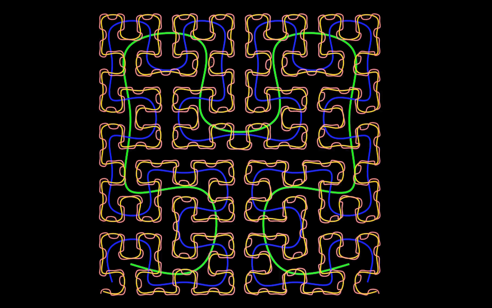

# 🌀 Hilbert Curve Visualization with Manim

This project demonstrates the recursive construction and animation of **Hilbert Curves**, a type of space-filling fractal. The animation is built with [Manim](https://www.manim.community/) and illustrates the recursive nature of the curve through smooth transformations and color-coded levels.



[Watch here!](https://youtu.be/ROr_MV8JT7E)

## 📐 What’s a Hilbert Curve?

The Hilbert Curve is a continuous fractal that fills a 2D space. It is widely used in:
- Computer graphics
- Data indexing (e.g., space-filling for cache coherence)
- Image compression
- Multidimensional sorting

## 🔍 Features

- Title animation and level-by-level curve construction
- Levels 1 through 5 visualized sequentially
- Smooth transformations between each recursive level
- Final scene with all curves animated in rotation
- Smooth fade-out exit animation

## 🎨 Visual Styling

| Feature          | Value                          |
|------------------|-------------------------------|
| Curve Levels      | 1 through 5                    |
| Colors            | Red, Green, Blue, Gold, Magenta, Cyan |
| Stroke Widths     | Decreasing from 6 to 1         |
| Background        | Black                          |
| Curve Animation   | Created + transformed + rotated + faded |

## 📦 Requirements

- Python 3.8+
- Manim Community Edition
- NumPy

```bash
pip install manim numpy
```

▶️ Run the Animation

```bash
manim -pql HilbertCurve_complete.py HilbertCurve
```

Use -qh instead of -pql for high quality.

📁 Files

    HilbertCurve_complete.py — Manim animation script

    README.md — Project documentation

🎓 Educational Use

Useful for:

    Teaching recursion and fractals

    Demonstrating space-filling curves

    Exploring curve complexity and geometric growth

---
🤝 Support Algorithmic Visualization

*Maintained with ❤️ by **Omniacs.DAO** – accelerating digital public goods through data.*

🛠️ Keep public infrastructure thriving. Buy [$IACS](http://dexscreener.com/base/0xd4d742cc8f54083f914a37e6b0c7b68c6005a024) on Base — CA: 0x46e69Fa9059C3D5F8933CA5E993158568DC80EBf
