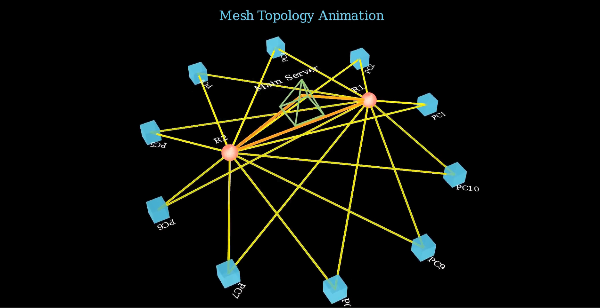

# Mesh Topology

Mesh topology refers to the arrangement of vertices, edges, and faces that form a 3D object. It’s fundamental in 3D modeling, simulations, and rendering.

This folder includes visualizations or tools to demonstrate how different topologies affect the shape, smoothness, and behavior of meshes under transformation.

It’s especially useful for developers, artists, and engineers working in graphics, animation, or scientific computing.

