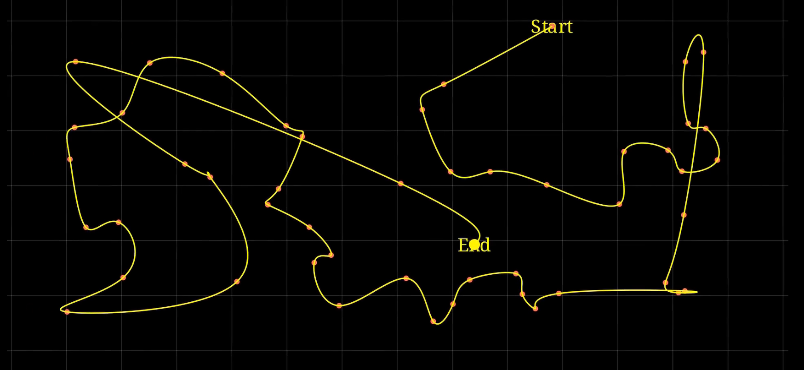

# 🗺️ Nearest Neighbor Pathfinding Visualization | Manim Animation

This Manim animation demonstrates the **Nearest Neighbor algorithm** as a greedy approach to pathfinding in a 2D space. Using randomly generated points, it constructs a path by successively visiting the closest unvisited point — creating a fast, but suboptimal tour.



[Watch here!]()

## 🔍 What It Demonstrates

- **Nearest Neighbor heuristic** for traversing a set of spatial points
- Concept of **greedy algorithms** in optimization problems
- **Path visualization** through animated tracing
- Radius-based neighborhood zones for spatial intuition
- Animated zoom & camera tracking for dramatic movement

## 🧠 Educational Highlights

| Feature           | Description |
|-------------------|-------------|
| 🔵 Random Points  | 50 scattered points on a number plane |
| 🌟 Start Point    | Chosen based on sparse local density |
| 🔁 Path Building  | Greedy selection of closest unvisited neighbor |
| 🟡 Radius Circles | Visual cues for local decision zones |
| 🧭 Traced Path    | Dynamic dot + trail following the constructed path |
| 🎥 Camera Zoom    | Follows the dot to emphasize path segments |
| 📜 Concluding Text | Final summary about the algorithm on screen |

## 📦 Requirements

- Python 3.8+
- Manim Community Edition
- NumPy

```bash
pip install manim numpy
```

▶️ How to Render
```
manim -pql PathFindingAlgo.py PathFinder
```
Use -qh for high-quality rendering.
📁 Files

    PathFindingAlgo.py — Animation logic
    README.md — This documentation

🎓 Ideal For

    Teaching greedy algorithms and heuristics
    TSP approximation demos
    Visual optimization tutorials
    AI pathfinding intros


---
🤝 Support Algorithmic Literacy

*Maintained with ❤️ by **Omniacs.DAO** – accelerating digital public goods through data.*

🛠️ Keep public infrastructure thriving. Buy [$IACS](http://dexscreener.com/base/0xd4d742cc8f54083f914a37e6b0c7b68c6005a024) on Base — CA: 0x46e69Fa9059C3D5F8933CA5E993158568DC80EBf
