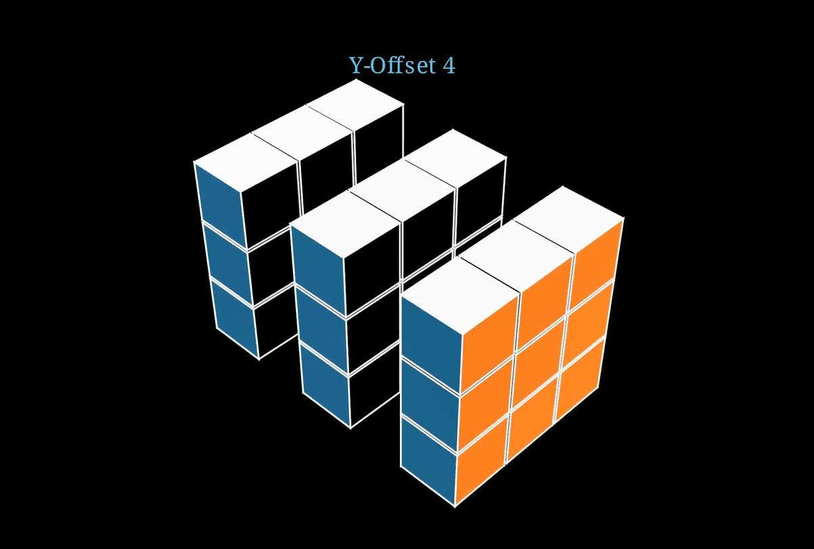

# 🧊 Rubik's Cube Solving Animation (CFOP Method) with Manim

This Manim animation showcases the **CFOP method** of solving a Rubik’s Cube, alongside demonstrations of cube offset manipulations and front-face indication. It leverages the `manim_rubikscube` plugin to visualize every twist, rotation, and layer interaction in beautiful 3D.



[Watch here!](https://youtu.be/XH3u21zanDw)

## 🔄 What’s Inside

- 🧠 **CFOP Solve Animation** using `solve_by_kociemba()` and custom cube state
- 🎥 **Camera movement** and ambient 3D rotation for immersive viewing
- 🧱 **Offset examples**:
  - 3D positional shifts with `x_offset`, `y_offset`, and `z_offset`
  - Layered transitions across scenes
- 🟦 **Indication of specific cube faces** using `Indicate()`

## 🧩 CFOP Breakdown

| Step            | Animation Part           |
|-----------------|--------------------------|
| Cross → F2L → OLL → PLL | Automatically solved using Kociemba algorithm |
| Part 2: Three Offset     | Cube with XYZ offset visualized in motion |
| Part 3: Y-Offset 4       | Vertical cube displacement animation |
| Part 4: Indicate Face    | Visually highlights front face of cube |

## 📦 Requirements

- Python 3.8+
- [Manim Community Edition](https://www.manim.community/)
- [`manim_rubikscube`](https://github.com/ManimCommunity/manim_rubikscube)

```bash
pip install manim
pip install manim-rubikscube
```

▶️ How to Run

```
manim -pql "Rubik_s Cube.py" CombinedRubiksCubeAnimations
```

Use -qh for high-res output.
📁 Files

    Rubik_s Cube.py — Manim animation script

    README.md — Documentation

🎓 Great For

    Teaching Rubik’s Cube solving logic
    Exploring Manim 3D scene building
    Understanding face mapping and rotations
    Visual experiments in spatial transformations


---
🤝 Support Generative Education
*Maintained with ❤️ by **Omniacs.DAO** – accelerating digital public goods through data.*

🛠️ Keep public infrastructure thriving. Buy [$IACS](http://dexscreener.com/base/0xd4d742cc8f54083f914a37e6b0c7b68c6005a024) on Base — CA: 0x46e69Fa9059C3D5F8933CA5E993158568DC80EBf
