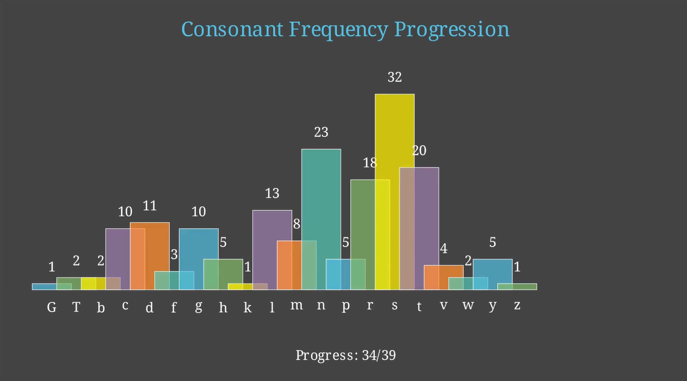
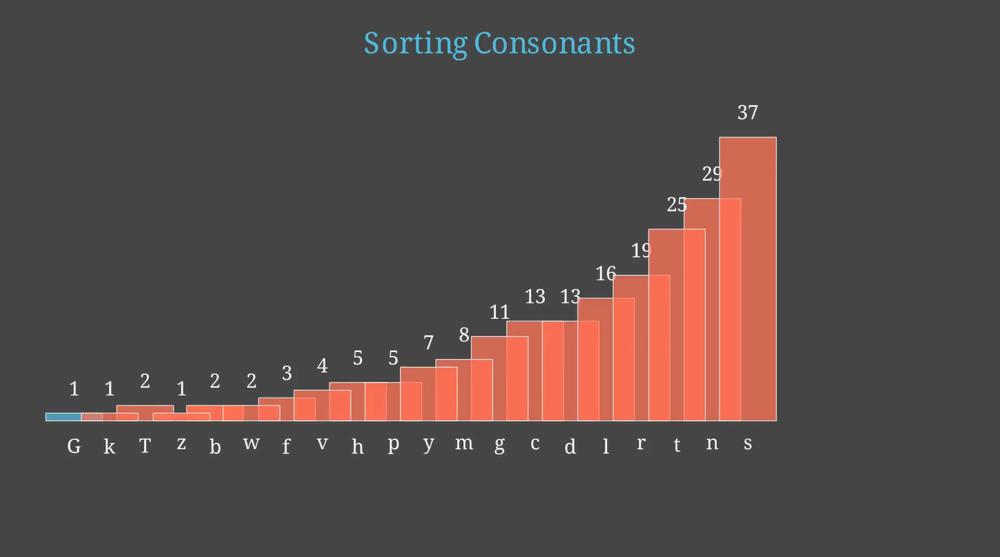

# 🔤 Consonant Frequency Histogram + Sorting Animation with Manim

This project animates the progressive counting and sorting of consonants in a block of text using [Manim](https://www.manim.community/). It visually builds a histogram of consonants over time, then performs a bubble sort on the bars based on frequency.




[Watch here!](https://youtu.be/B6fGCMDI5Fw)

## 📚 What It Does

- 📈 Tracks and displays consonant frequency as text is processed
- 🔢 Generates a colorful histogram at each 10-character interval
- 🔁 Animates sorting of consonants using the **bubble sort** algorithm
- 🎨 Uses color-coded bars, labels, and progress indicators

## 🧠 Educational Concepts

- Progressive text parsing
- Character frequency analysis
- Histogram visualization
- Sorting algorithm (Bubble Sort)
- Visual data storytelling

## 🧩 How It Works

| Stage            | Description |
|------------------|-------------|
| Parsing          | Counts consonants incrementally through the text |
| Histogram Build  | Animated histogram shows frequency buildup |
| Sorting          | Bubble sort reorders bars by frequency using movement & color |

### Text Sample Used:
> “Omni Analytics Group, found at omnianalytics.org, is a consulting firm...”

## 📦 Requirements

- Python 3.8+
- Manim Community Edition
- collections (standard lib)

```bash
pip install manim
```

▶️ How to Run

```
manim -pql Consonant_anim.py ConsonantHistogram
```
Use -qh for high-res output.
📁 Files

    Consonant_anim.py — Manim animation logic
    README.md — This file

🎓 Perfect For

    Language processing demos
    Teaching character frequency analysis
    Exploring algorithmic animations
    Engaging classroom presentations


---
🤝 Support Educational Visualization
*Maintained with ❤️ by **Omniacs.DAO** – accelerating digital public goods through data.*

🛠️ Keep public infrastructure thriving. Buy [$IACS](http://dexscreener.com/base/0xd4d742cc8f54083f914a37e6b0c7b68c6005a024) on Base — CA: 0x46e69Fa9059C3D5F8933CA5E993158568DC80EBf
