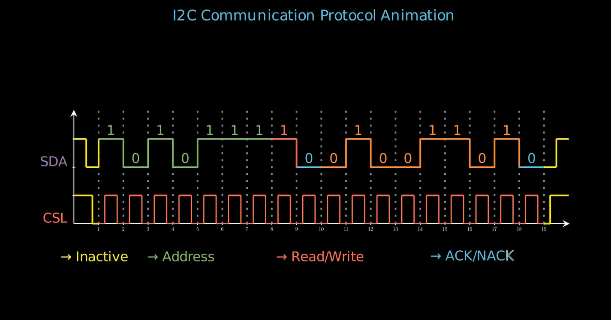

The I2C (Inter-Integrated Circuit) protocol is a synchronous, multi-master, multi-slave serial communication bus. It uses two wires (SDA for data, SCL for clock) for short-distance communication between ICs. I2C is widely used in sensors, EEPROMs, and displays due to its simplicity, low pin count, and moderate speed (up to 5 Mbps). Its practicality lies in efficient data transfer with minimal wiring, making it ideal for embedded systems.

