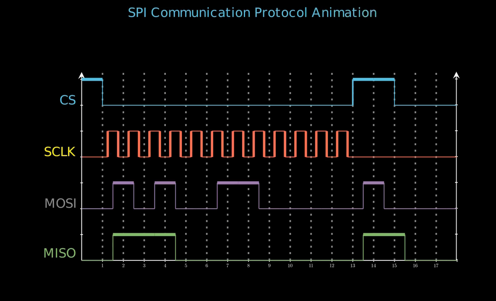

The SPI (Serial Peripheral Interface) protocol is a high-speed, full-duplex serial communication standard used for short-distance communication between microcontrollers and peripherals (sensors, displays, memory). It uses four wires (MOSI, MISO, SCLK, SS) for synchronous data transfer with no addressing overhead. SPI is faster than I2C (up to 100+ Mbps) but requires more pins, making it ideal for high-speed applications like flash memory, ADCs, and touchscreens.

