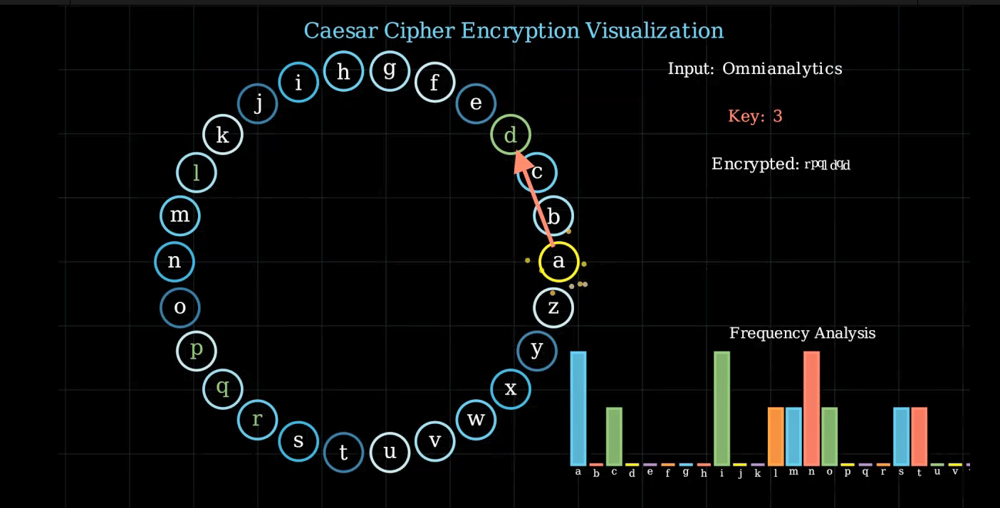

# 🔐 Caesar Cipher Encryption Visualization with Manim

This project uses [Manim](https://www.manim.community/) to animate the **Caesar Cipher** encryption process, step-by-step. It brings together classic cryptography, frequency analysis, and animated particle/glow effects for a visually rich explanation.



[Watch here!](https://youtu.be/VKUggYoD-9Y)

## 🧠 What is Caesar Cipher?

The Caesar Cipher is a substitution cipher where each letter in the plaintext is shifted by a fixed number (key). For example, with a key of 3:  
- `a → d`, `b → e`, ..., `x → a`

This animation demonstrates:
- Alphabet ring layout
- Character-by-character encryption
- Real-time frequency histogram
- Dynamic glow, arrow, and particle animations

## 🔍 Visual Features

| Element             | Description |
|---------------------|-------------|
| 🔠 Alphabet Ring     | Letters arranged in a circular layout |
| 🔑 Encryption Key    | Used to shift each character forward |
| 🌪️ Particle Effects  | Show activity at each encryption step |
| ✨ Glow/Arrow Paths  | Arrows connect original to encrypted characters |
| 📊 Histogram         | Frequency of letters in input string |
| 🎬 Smooth Transitions | Everything animates cleanly with fade-outs and scaling |

### Input Used:
- Text: `"Omnianalytics"`
- Key: `3`

## 📦 Requirements

- Python 3.8+
- Manim Community Edition
- NumPy

```bash
pip install manim numpy
```

▶️ Run the Animation

```
manim -pql Caesar_cipher.py EnhancedCaesarAnimation
```
Use -qh for high-quality rendering.
📁 Files

    Caesar_cipher.py — Main Manim animation
    README.md — This file

🎓 Educational Use

Great for:

    Teaching basic encryption
    Visualizing substitution ciphers
    Crypto history presentations
    Storytelling with math & animation


---
*Maintained with ❤️ by **Omniacs.DAO** – accelerating digital public goods through data.*

🛠️ Keep public infrastructure thriving. Buy [$IACS](http://dexscreener.com/base/0xd4d742cc8f54083f914a37e6b0c7b68c6005a024) on Base — CA: 0x46e69Fa9059C3D5F8933CA5E993158568DC80EBf


