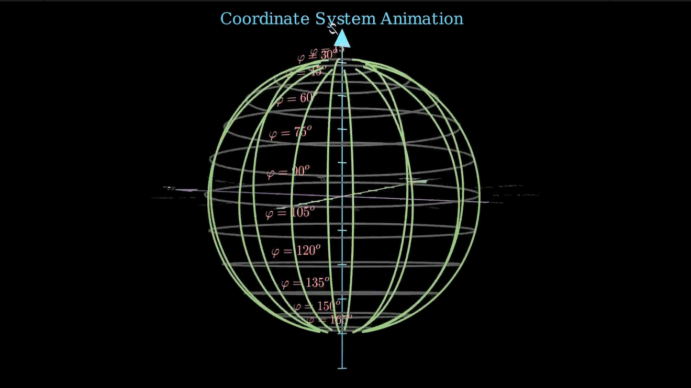

# 📐 3D Coordinate System Visualization with Manim

This project visualizes a **3D coordinate system** using [Manim](https://www.manim.community/) and animates angular structures such as **ϕ (phi)** and **θ (theta)** commonly found in spherical or cylindrical coordinate systems.



[Watch here!](https://youtu.be/6tzX9tJuCi8)

## ✨ What’s Visualized

- 3D coordinate axes (X, Y, Z) in distinct colors
- Animated polar slices for **ϕ (phi)** from 15° to 165°
- Rotating circular arcs representing **θ (theta)** from 0° to 330°
- Smooth camera movements to illustrate spatial relationships

## 🧠 Concepts Illustrated

- 3D coordinate systems
- Polar/spherical geometry
- Angular motion in space
- Phi (vertical) vs Theta (horizontal) angular sweep

## 🎨 Visual Elements

| Element       | Color      |
|---------------|------------|
| X-axis        | Purple     |
| Y-axis        | Green      |
| Z-axis        | Blue       |
| Phi circles   | Dark Grey  |
| Theta arcs    | Green      |
| Angle labels  | Red & Grey |

## 🛠️ Requirements

- Python 3.8+
- [Manim Community Edition](https://docs.manim.community/)
- NumPy

```bash
pip install manim numpy
```

▶️ How to Render

Run the animation using:

```bash
manim -pql Cordinate_system.py axesIn3D
```

Use -qh instead of -pql for high quality output.
📁 File Overview

    Cordinate_system.py — Main script with 3D geometry logic

    README.md — Documentation

🎓 Educational Use Cases

This animation is useful for:

    Teaching 3D coordinate systems

    Explaining spherical geometry

    Introducing concepts in robotics, 3D modeling, or physics


---
🤝 Support Algorithmic Education

*Maintained with ❤️ by **Omniacs.DAO** – accelerating digital public goods through data.*

🛠️ Keep public infrastructure thriving. Buy [$IACS](http://dexscreener.com/base/0xd4d742cc8f54083f914a37e6b0c7b68c6005a024) on Base — CA: 0x46e69Fa9059C3D5F8933CA5E993158568DC80EBf
